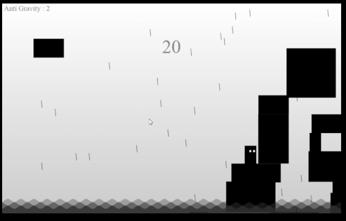

# Its-raining-boxes

Its raining boxes is game made in pure javscript

It's raining boxes, and you are stuck on a platform :(.
Avoid drowning in the water by stacking the boxes and jumping on them.
raining boxes will not effect by gravity after when they stuck on any other box.
you will die if u fall in water and if any rainig box falls on ur head.
u can move right and left. push boxes and stacking the boxes.
u can activate anti-gravity for 9 seconds by pressing mouse right click. then u can drag and drop any box anywhere within canvas.
u can jump twise but when u jump 2nd times then u release 3 bombs they will blast boxes or leave the canves.
after every 13 seconds a line will apears for 13 seconds at the top of canvas. if u reach this coordinates the u will get 3 antigravity points.

* player controls as follow. 
  * 'W' OR '↑' : jump
  * 'A' OR '←' : move left
  * 'D' OR '→' : move right
  * 'mouse right click' : activate anigravity
player can move right or left, jump and can push boxes.
u can test my game obviously by playing it then take a look to code style and logics :)

* game_old.js have a bug that i tested my game in low low specification pc with 2gb ram and 2.0GHz processor. game where run in slow motion.
* i don't impliment sounds effects.
* i was trying to implemet gravity to boxes those stuck on other boxes then i relize that game is more funable without this.
